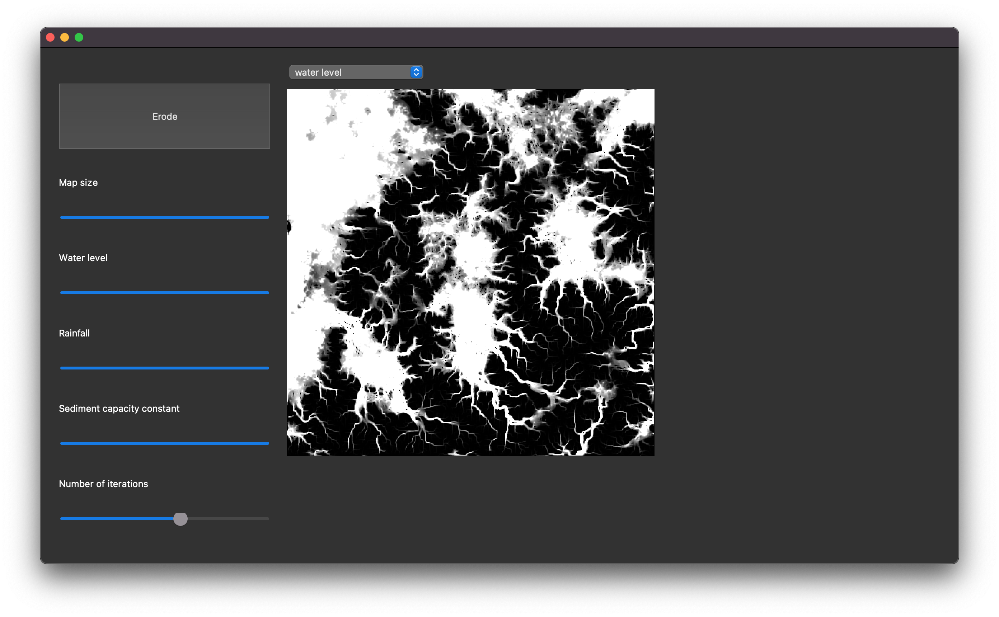

# Hydraulic Erosion Simulator

A python implementation of the paper [Fast Hydraulic Erosion Simulation and Visualization on
GPU](https://hal.inria.fr/inria-00402079/document).

To run, install the appropriate packages and execute the GUI program found in the `src` folder:

```
> python gui.py
```

Here is a screenshot of the GUI:



## Engine & Algorithm
The algorithm (src/algorithm.py) was implemented from the above paper with a few additions
found in the authors' implementation, which can be found 
[here](https://github.com/Huw-man/Interactive-Erosion-Simulator-on-GPU).
